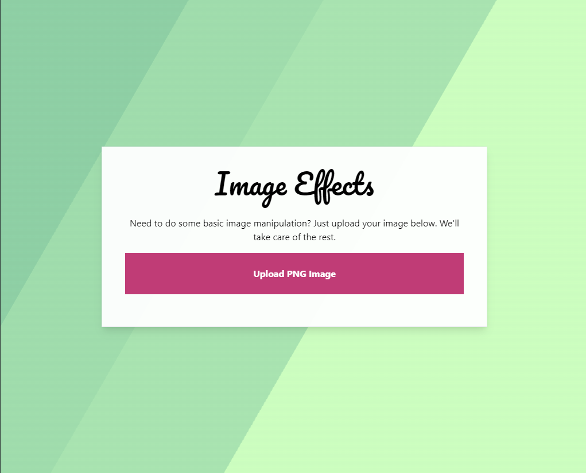

# IMAGE-EFFECT: A WEBASSEMBLY & RUST PROGRAM

By Reed Meher | 2024

## TABLE of CONTENTS

- [Summary](#summary)
- [Purpose of Program Files](#purpose-of-program-files)
- [How to Use](#how-to-use-the-program)
- [Future Development and Improvement](#future-development-and-improvement)
- [About the Author](#about-the-author)

## SUMMARY

Image-Effect allows users to upload images convert them to grayscale. They can then view and download the modified image. This application was built with WebAssembly, Rust, and some helpful tools outlined below. The application has been deployed via Vercel.

[Visit deployed application](https://image-effects-xi.vercel.app/)

## LANGUAGES & TECH

- [Rust](https://rust-lang.github.io/rustup/)
- [webpack](https://webpack.js.org/)
- [wasm-tool/wasm-pack-plugin](https://github.com/wasm-tool/wasm-pack-plugin)
  - for integrating Rust and JS. learn more at [wasm-pack](https://rustwasm.github.io/wasm-pack/book/)
- [wasm-bindgen](https://crates.io/crates/wasm-bindgen)
  - for chatting between JS and Rust.

## HOW TO USE

All you need to do is visit the [website](https://image-effects-xi.vercel.app/), upload a photo, and you will get your modified photo back right in the browser. 🥲🌠

## FUTURE DEVELOPMENT and IMPROVEMENT

Upcoming soon, you will have the choice between many photo filters!

## ABOUT the AUTHOR

Reed Meher is a web developer based in Minnesota. See his portfolio at [meherdevs.com](https://www.meherdevs.com), follow him on [LinkedIn](https://www.linkedin.com/in/reed-meher), or reach out with questions via [email](mailto:reed@meherdevs.com).

---

Made with ❤️ by Reed Meher | 2024
